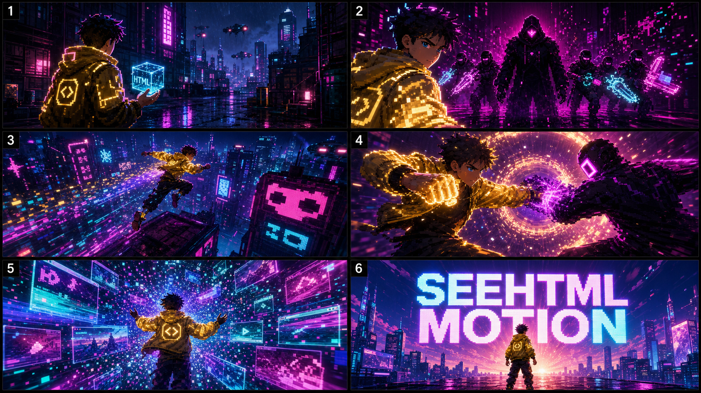

# SeeHTML AI Marketing Kit

[中文](#中文) | [English](#english)

## 中文

### 一句话介绍

SeeHTML AI 是一个本地桌面端 Agent 工作台，用自然语言生成 HTML 页面、Canvas 动画、PPT 和 MP4 视频。

### 短介绍

SeeHTML AI 把 HTML 创作变成一个可预览、可导出、可迭代的本地工作流。你可以打开一个项目，直接告诉 Agent 想做什么：产品页、演示页、粒子动画、剧情短片、PPT 或 MP4。Agent 会生成完整 HTML，中间窗口实时预览，最后可以按页面导出 PowerPoint，或者把动画逐帧渲染成 MP4。

### 适合传播的卖点

- HTML 不只是网页，也可以是短视频和动态演示。
- 用 Agent 写完整 HTML，不是套模板。
- 生成后立即预览，修改后继续迭代。
- 动画 HTML 可以导出 1080p MP4。
- PPT 按页面导出，适合做演示、课程、汇报。
- 每个项目独立记忆，不串上下文。
- 模型可自定义，支持 OpenAI-compatible API。

### Demo 素材

封面图：


宣传视频：

[assets/seehtml-motion-promo.mp4](assets/seehtml-motion-promo.mp4)

剧情打斗 storyboard：



### 小红书风格标题

- HTML 也能拍出镜头感？我做了一个能导出 MP4 的 AI 桌面工具
- 我把网页变成了一支赛博短片
- 不用剪辑软件，用 HTML + Agent 做一个动态宣传片
- 以后做 PPT 和宣传视频，我可能都从 HTML 开始
- 这个工具能把静态网页渲染成 MP4

### 小红书正文示例

我一直觉得 HTML 不应该只停留在“网页”。

它其实可以同时表达布局、字体、粒子、镜头、剧情、转场和动画。

所以我做了 SeeHTML AI：一个本地桌面端 Agent 工作台。你打开一个项目，输入一句需求，它会生成完整 HTML，并且可以直接预览。如果是动画，还能通过逐帧渲染导出 MP4；如果是演示页，也能按页面导出 PPT。

这条 demo 是用 HTML + Canvas 做出来的：赛博霓虹、像素城市、粒子流光、镜头推进，最后导出成视频。

我想让它变成一个“HTML 创作到视频/演示”的开源工具。

### 30 秒剧情打斗宣传片提示词

```text
做一个 30 秒的 HTML Canvas 宣传短片，风格参考赛博霓虹、小红书爆款短视频、像素未来城市、粒子流光、镜头推进和剧情打斗。

主题：SeeHTML Motion，把“静态 HTML 变成有镜头感的动态短片”。

要求：
1. 做成 16:9，适配 1920x1080 MP4 导出。
2. 必须有剧情，不只是背景动效。
3. 剧情分 6 个镜头，每个镜头约 5 秒：
   - 0-5s：雨夜霓虹城市，主角拿着发光 HTML 方块登场。
   - 5-10s：黑色数据猎手出现，城市开始故障闪烁。
   - 10-15s：主角 rooftop chase，粒子拖尾和镜头快速推进。
   - 15-20s：主角和数据猎手进行光效格斗，拳脚带粒子能量弧。
   - 20-25s：主角击碎数据牢笼，粒子变成网页、动画帧、PPT 页面。
   - 25-30s：品牌收束，出现大标题 SEEHTML MOTION 和一句宣传语。
4. 动画要有镜头语言：推近、横移、震动、慢动作、粒子爆发、文字入场。
5. 不能血腥，打斗是风格化能量碰撞。
6. 使用纯 HTML + CSS + Canvas + JS，不能依赖外部 CDN。
7. 必须支持 MP4 逐帧导出：
   - 定义 DURATION = 30
   - 设置 window.__SEEHTML_EXPORT_DURATION__ = 30
   - 实现 renderAtTime(seconds)
   - 设置 window.renderAtTime = renderAtTime
   - 监听 seehtml:export-frame 事件
   - 支持 window.__SEEHTML_EXPORT_TIME__
8. 画面第一帧不能空白，最后一帧要稳定停在品牌 end card。
9. 返回完整 <!DOCTYPE html>，不要 Markdown。
```

### 开源发布说明

推荐发布时强调：

- 本项目是本地桌面工具，不绑定任何单一模型服务。
- 仓库不包含生产 API Key。
- FFmpeg / OCR 等运行时依赖由构建脚本准备，不直接提交大体积二进制运行时。
- Demo 视觉方向只是示例，Agent Skill 是后台思考过程，不限制用户需求。

---

## English

### One-Liner

SeeHTML AI is a local desktop Agent workspace for generating HTML pages, Canvas animations, PowerPoint decks, and MP4 videos from natural language.

### Short Description

SeeHTML AI turns HTML creation into a previewable, exportable, iterative local workflow. Open a project, describe what you want, and let the Agent generate complete HTML. Preview it instantly, export pages to PowerPoint, or render animated HTML frame-by-frame into MP4.

### Key Messages

- HTML can be more than web pages; it can become animated shorts and visual presentations.
- Agent-generated HTML, not fixed templates.
- Preview immediately, iterate naturally.
- Animated HTML can be exported to 1080p MP4.
- HTML pages can become PowerPoint slides.
- Each project has isolated memory and context.
- Model provider is configurable through OpenAI-compatible APIs.

### Demo Assets

Cover:


Promo video:

[assets/seehtml-motion-promo.mp4](assets/seehtml-motion-promo.mp4)

Storyboard:


### Social Post Ideas

- What if HTML could feel like a cinematic short?
- I turned a static web page into a cyber-neon MP4.
- Building a desktop Agent that exports HTML animations as video.
- From HTML to PPT and MP4, without leaving one project.
- Canvas animation meets local AI workflow.

### 30-Second Story/Fight Promo Prompt

```text
Create a 30-second HTML Canvas promo short with cyber-neon, social-video energy, retro-future pixel city visuals, particle trails, cinematic camera movement, and stylized fight choreography.

Theme: SeeHTML Motion, turning static HTML into cinematic motion shorts.

Requirements:
1. Use a 16:9 stage designed for 1920x1080 MP4 export.
2. Include a story, not only a background effect.
3. Structure the film into six 5-second shots:
   - 0-5s: rainy neon city, hero appears holding a glowing HTML cube.
   - 5-10s: dark data hunters arrive and the city starts glitching.
   - 10-15s: rooftop chase with particle trails and fast camera push.
   - 15-20s: stylized energy fight with glowing punches and arcs.
   - 20-25s: hero breaks a data cage; particles become web pages, animation frames, and PPT slides.
   - 25-30s: final brand end card with SEEHTML MOTION and one tagline.
4. Use cinematic motion: camera push, pan, shake, slow motion, particle bursts, and kinetic title entrance.
5. No gore; the fight is stylized energy collision.
6. Use pure HTML + CSS + Canvas + JavaScript, no external CDN.
7. Support deterministic MP4 frame export:
   - define DURATION = 30
   - set window.__SEEHTML_EXPORT_DURATION__ = 30
   - implement renderAtTime(seconds)
   - assign window.renderAtTime = renderAtTime
   - listen for seehtml:export-frame
   - support window.__SEEHTML_EXPORT_TIME__
8. The first frame must not be blank, and the final frame must hold on a stable brand end card.
9. Return one complete <!DOCTYPE html> document and no Markdown.
```

### Open Source Launch Notes

When publishing, make clear that:

- The project is a local desktop tool and does not lock users into one model vendor.
- No production API keys are committed.
- FFmpeg / OCR runtime dependencies are prepared by scripts instead of committing heavy binaries.
- The demo style is a creative example. Agent skills are internal thinking guides and do not restrict user requirements.
